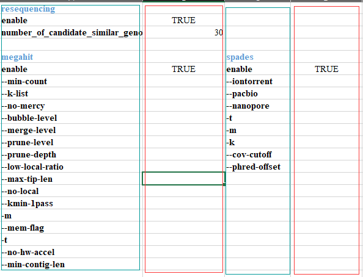

# PBGI

PBGI is an effective approach and automatic bioinformatics pipeline for bacterial genome identification, performing automatedly and customized bioinformatics analysis using short-reads or long-reads sequencing data produced by multiple platforms such as Illumina, PacBio and Oxford Nanopore.  

## Install

### From github

1.```git clone https://github.com/lyotvincent/PBGI.git```  
2.run ```python download_bacteria_data``` to build bacteria local database.  
3.Install external tools  
>```conda install -y fastqc```  
```conda install -y fastp```  
```conda install -y trimmomatic```  
```conda install -y cutadapt```  
```conda install -y megahit```  
```conda install -y spades```  
```conda install -y velvet```  
```conda install -y quast```  
```conda install -y blast```  
```conda install -y blat```  
```conda install -y prokka```  
```conda install -y prodigal```  
```conda install -y snap-aligner```  
```conda install -y bowtie2```  
```conda install -y samtools```  
```conda install -y minimap2```  
```pip install biopython bcbio-gff xlrd pyyaml datasketch```

### From conda

We are working for this.  (```conda install pbgi_pipeline -c bioconda```)

## External tools
These software/tools respectively support part of the entire pipeline. If you want to use all the functions of the pipeline, all these software in the table should be installed.
The ✔ in 'conda' column means that the software cound install by conda.

|software|conda|download link|
|----|----|----|
|FastQC|✔|<http://www.bioinformatics.babraham.ac.uk/projects/fastqc/>|
|fastp|✔|<https://github.com/OpenGene/fastp>|
|trimmomatic|✔|<https://github.com/timflutre/trimmomatic>|
|cutadapt|✔|<https://github.com/marcelm/cutadapt>|
|megahit|✔|<https://github.com/voutcn/megahit>|
|spades|✔|<https://github.com/ablab/spades>|
|velvet|✔|<https://github.com/dzerbino/velvet>|
|QUAST|✔|<https://github.com/ablab/quast>|
|BLAST|✔|<https://blast.ncbi.nlm.nih.gov/Blast.cgi>|
|prokka|✔|<https://github.com/tseemann/prokka>|
|prodigal|✔|<https://github.com/hyattpd/Prodigal>|
|snap-aligner|✔|<https://github.com/amplab/snap>|
|bowtie2|✔|<https://github.com/BenLangmead/bowtie2>|
|samtools|✔|<https://github.com/samtools/samtools>|
|minimap2|✔|<https://github.com/lh3/minimap2>|
|biopython|✔|pip
|bcbio-gff|✔|pip
|xlrd|✔|pip
|pyyaml|✔|pip

```pip install datasketch``` need to be installed by the user.  

## Databases
Bacterial data can be downloaded from the database below.  

NCBI Genbank  
Drugbank  
PATRIC  
CARD  

```download_bacteria_data.py``` could download bacterial data from NCBI Genbank to local file folder and build blastdb based on ```makeblastdb```.  
Unfortunately, due to problems such as the need for authentication, the data for Drugbank,PATRIC,CARD needs to be configured by the user.  

## Help

simple usage
```python pbgi_pipeline.py -1 XXX.fastq -2 XXX.fastq -ngs -conf_file_path ./pbgi_configuration.xlsx -o ./result_folder/XXX```  

```python pbgi_pipeline.py -h``` to help.  

parameters in pipeline:  

help:  
-f input single end file  
-1 and -2 input paired end files  
-o out directory name  
-ngs make pipeline run for next-generation sequencing data (short reads)  
-3gs make pipeline run for third-generation sequencing data (long reads)  
-conf_file_path configuration file for PBGI pipeline which is in xlsx format  
-h or -help or --h or --help look help  

## Configuration file

```pbgi_configuration.xlsx``` in the ```Help``` is the configuration file of PBGI.  
Users could customize parameters in this configuration file.  

  

The picture is a screenshot of part of the configuration file.  
The green box contains the parameter name. Users could enter parameters in the red box to customize the software.  
In order to control the choice of software, users could set True or False for the "enable" of software.


<!-- 
## 主要测试菌种
肠杆菌属Enterobacteriaceae  
链球菌属Streptococcus spp.  
乳杆菌属Lactobacillus spp.  
幽门螺杆菌属Helicobacterpylori spp.  
白色念珠菌属Candida albicans spp.  
拟杆菌属Bacteroides spp.  
梭菌属Clostridium spp.  
肠球菌属Enterococcus spp.  
双歧杆菌属Bifidobacterium spp.  
真杆菌属Eubacterium spp.   -->
